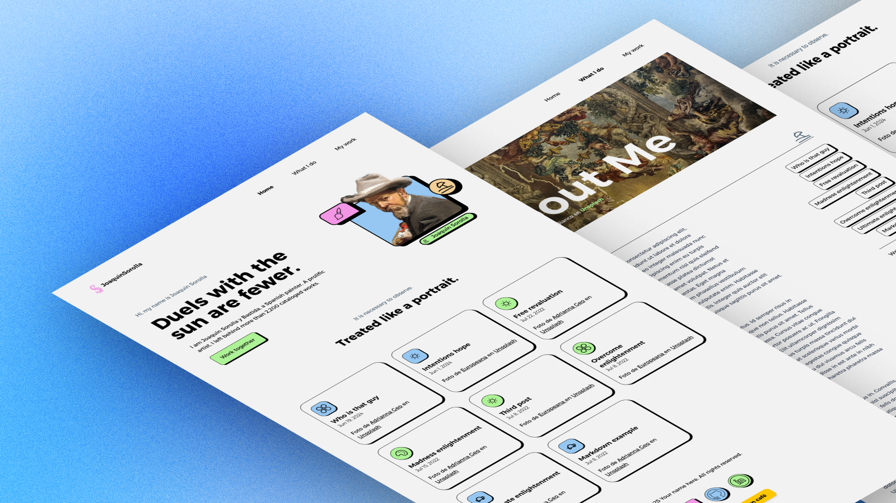

# seasKanon.me



**seasKanon，四季的卡农。经典在变奏里重生。**

Personal website of **Cody** — a mathematics student building a long-term digital home for writing, projects, and knowledge. The site is designed to feel like a handmade desk: notes, cards, experiments, and colorful reminders of things being learned.

🔗 Live site: [seaskanon.me](https://seaskanon.me)

---

## 🧭 Site Structure

| Page | Description |
|---|---|
| **Home** (`/`) | Hero introduction + "What I Do" skill cards |
| **Writing** (`/writing`) | Blog posts, essays, and reading notes with search, categories, tags, series, and pagination |
| **Projects** (`/projects`) | Project gallery — SageRoute, mathematical modeling, coursework, research experiments |
| **Knowledge** (`/knowledge`) | Future Quartz-powered knowledge base (reserved route, coming soon) |
| **About** (`/about`) | About Cody / seasKanon with social links |
| **RSS** (`/rss.xml`) | RSS feed for writing posts |

### 📝 Writing Topics

- **Causal Inference** — graphical models, randomized trials, linear regression
- **Mathematical Modeling** — decision trees, logistic regression, LASSO
- **Philosophy & Culture** — fascist aesthetics, phenomenology of AI
- **Neuroscience & Education** — compulsory schooling, optimization traps

---

## 🛠️ Tech Stack

- **[Astro](https://astro.build)** — Static site builder (v6)
- **[Tailwind CSS](https://tailwindcss.com)** — Utility-first CSS framework (v4)
- **TypeScript** — Type-safe content collections
- **MDX** — Rich content with embedded components
- **KaTeX** — Mathematical typesetting
- **Astro Icon** — SVG icon system
- **Sharp** — Image optimization
- **Vercel** — Deployment target

### 🎨 Custom Theme System

The site features a custom CSS-variable theme switcher with **4 color schemes**, each with distinct card shadows, borders, and color palettes (pink, blue, green, yellow accents).

### 🎵 BGM Player

A capsule-style background music player with playlist support, controllable from any page.

---

## 📂 Project Structure

```
seaskanon.me/
├── public/                 # Static assets (fonts, images, icons)
├── src/
│   ├── assets/             # Images and BGM playlist
│   ├── components/         # Reusable Astro components
│   │   ├── blog/           # Blog-specific components (Sidebar, Search, etc.)
│   │   ├── projects/       # Project gallery components
│   │   ├── BaseHead.astro
│   │   ├── Footer.astro
│   │   ├── Header.astro
│   │   ├── Hero.astro
│   │   └── WhatIDo.astro
│   ├── content/            # Markdown/MDX content
│   │   └── blog/           # Blog posts organized by topic
│   ├── data/               # Taxonomy descriptions, project data
│   ├── icons/              # SVG icons
│   ├── layouts/            # Page layouts (BlogPost, WritingPost)
│   ├── lib/                # Utility functions (writing stats, images, playlist)
│   ├── pages/              # Route pages (Astro file-based routing)
│   ├── plugins/            # Remark/Rehype plugins
│   └── styles/             # Global CSS
├── astro.config.mjs
├── package.json
├── tailwind.config.mjs
└── tsconfig.json
```

---

## 🚀 Getting Started

### Prerequisites

- **Node.js** ≥ 18
- **pnpm** (recommended)

### Development

```bash
# Clone the repository
git clone https://github.com/CodyFarm/seaskanon.me.git
cd seaskanon.me

# Install dependencies
pnpm install

# Start development server
pnpm dev
```

The site will be available at `http://localhost:4321`.

### Build

```bash
pnpm build
```

Output is in the `dist/` directory.

---

## 📄 Credits

- **Template** — Adapted from [jramma's Sorolla Portfolio](https://github.com/jramma/sorollaportfolio)
- **Projects page design** — Adapted from [studiofreight.com](https://studiofreight.com)
- **Icons** — Custom SVG icons + Astro Icon

## 📄 License

This project is licensed under the [MIT License](LICENSE).
